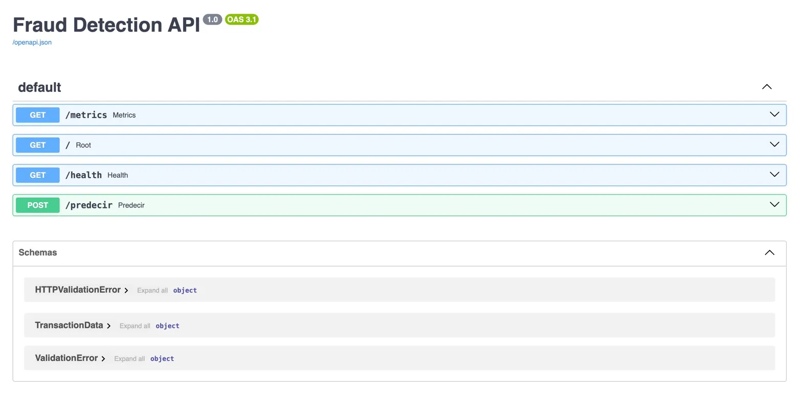
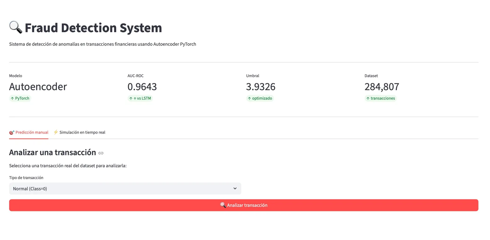
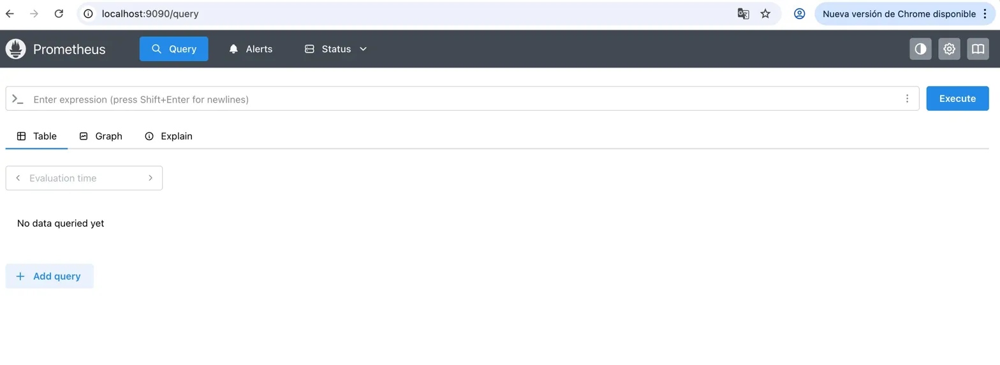
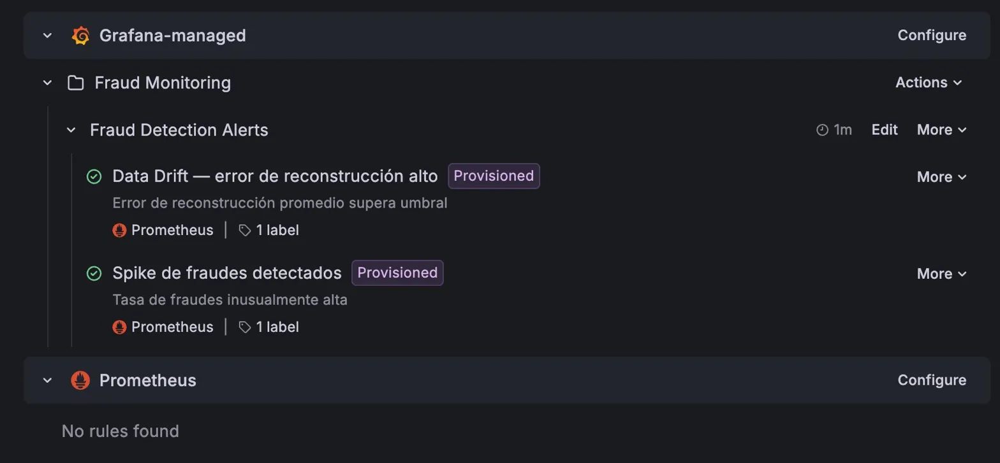
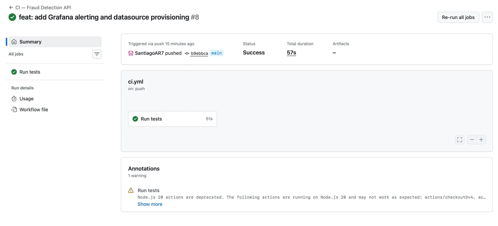

# 🔍 Fraud Detection System

> **Sistema de detección de anomalías en transacciones financieras** — Autoencoder PyTorch end-to-end con API REST, monitoreo en tiempo real con Prometheus + Grafana, orquestación con Apache Airflow y demo interactiva con Streamlit.

---

## 📌 El problema de negocio

**El fraude con tarjetas de crédito cuesta más de $30 billones anuales a nivel global.**

Este proyecto construye un sistema completo de detección de anomalías que identifica transacciones fraudulentas en tiempo real, sin necesidad de datos etiquetados para el entrenamiento. El sistema aprende el patrón de transacciones normales y marca automáticamente todo lo que se desvía de ese patrón — incluyendo fraudes nunca vistos antes.

---

## 📸 Screenshots

### API REST — FastAPI + Swagger UI

### Dashboard interactivo — Streamlit

### Monitoreo — Prometheus

### Alertas automáticas — Grafana

### CI/CD — GitHub Actions

---

## 🏗️ Arquitectura del sistema